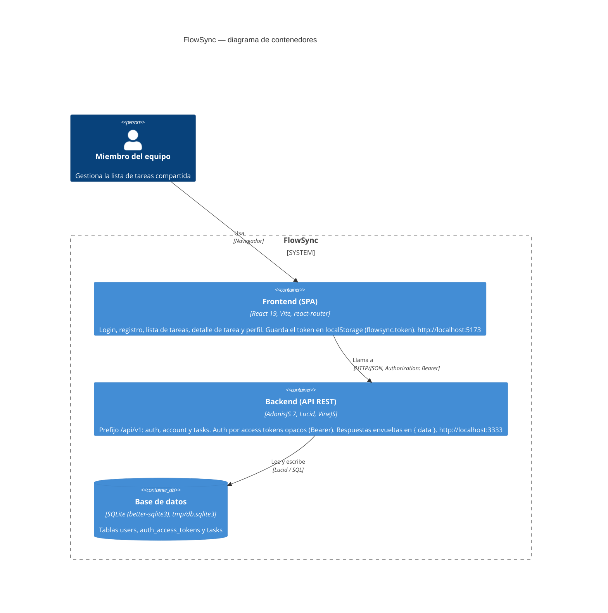
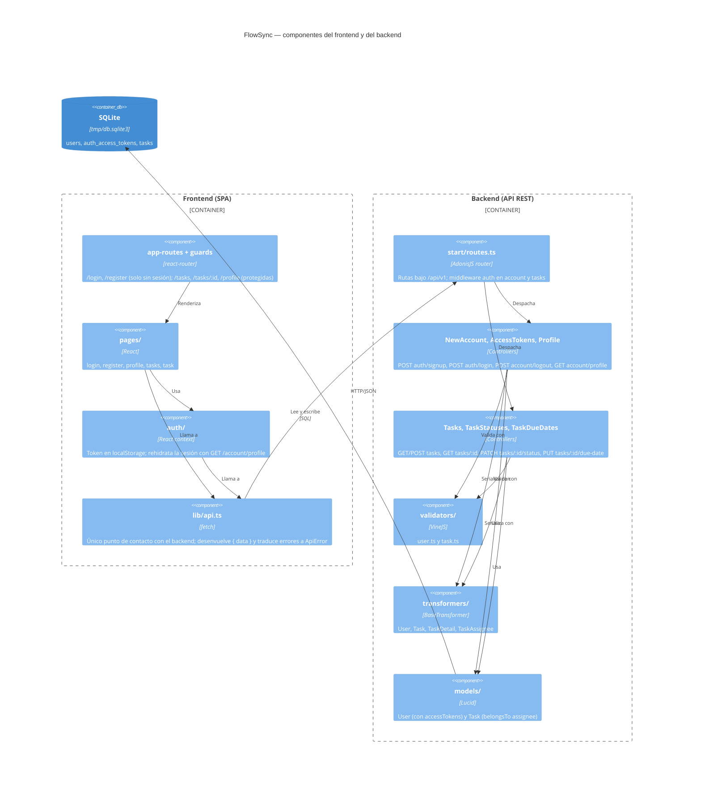

# Arquitectura de FlowSync

Este diagrama muestra los contenedores de FlowSync en notación C4: la SPA de React que
usa el equipo, la API de AdonisJS a la que llama por HTTP/JSON y la base de datos SQLite
donde se guardan cuentas, tokens y tareas. Dentro de cada contenedor se ven las piezas que
existen hoy en el código. En el frontend son el cliente de API, el contexto de sesión y
las pantallas. En el backend, los controladores agrupados por ruta, los validadores, los
transformers y los modelos. Solo se dibuja lo verificado en `backend/` y `frontend/`.

## Contenedores por dentro

Los componentes no son contenedores C4 propiamente dichos. Este segundo diagrama usa
`C4Component` para detallar qué hay dentro de cada uno.

